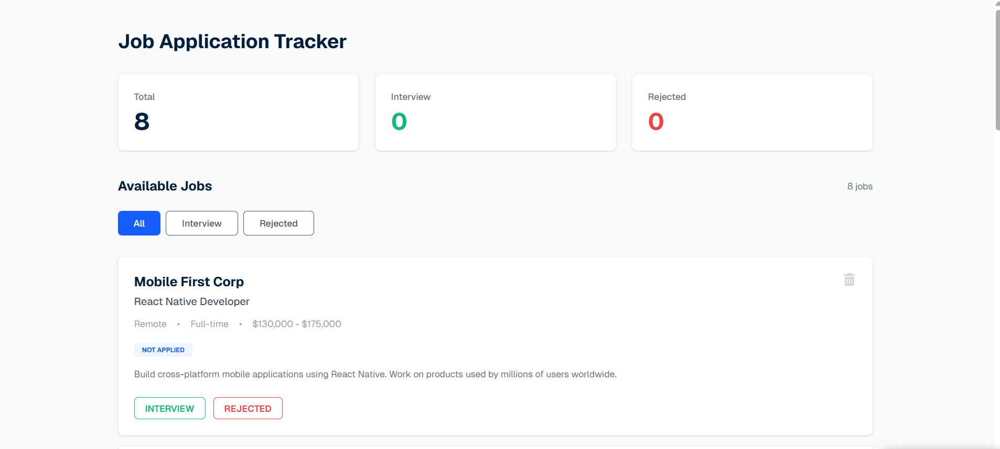

# Job Application Tracker

A simple web application that helps users track and manage job applications efficiently.

This project allows users to add job applications, monitor their status, and keep all job search information organized in one place.  
It was created as a practice project to improve front-end development skills using JavaScript and DOM manipulation.

---

## 🚀 Live Demo

https://shahid-97-ahamed.github.io/Job-Application-Trakers/

---

## 📸 Screenshot

---

## 🛠️ Technologies Used

- HTML5
- CSS3
- JavaScript (Vanilla JS)
- TailwindCSS
- LocalStorage API

---

## ⚙️ Features

- Add new job applications
- Track application status
- Store company name and job details
- Save application data using LocalStorage
- Simple and clean user interface
- Responsive layout

---

## 📂 Project Structure

Job-Application-Trakers
│
├── index.html
├── scripts/
│   └── script.js
├── jobs.png
├── tailwind.config.js
└── README.md

---

## 📚 What I Learned

- DOM manipulation with JavaScript
- Handling form input data
- Managing application state
- Using LocalStorage for persistent data
- Structuring a front-end project

---

## 🔮 Future Improvements

- Add edit and delete options
- Add search and filter functionality
- Add job application status categories
- Connect with backend database
- Add authentication system

---

## 👨‍💻 Author

AHAMED SHAHID

GitHub  
https://github.com/Shahid-97-Ahamed

---

⭐ If you like this project, feel free to star the repository.
